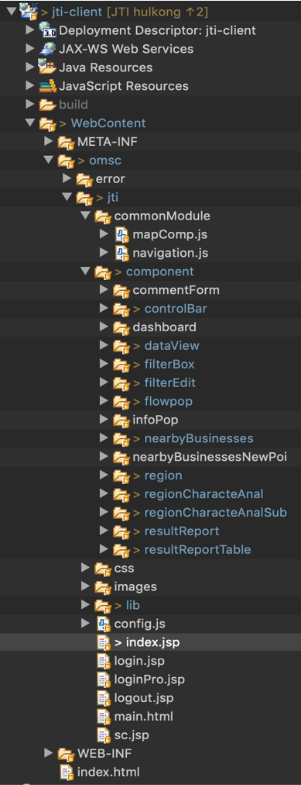

# JTI service

## 프로젝트 시작하게 된 동기

### SI 프로젝트이며 고객사는 JTI이다. 모회사 솔루션 중 하나인 WMS 타일맵서버를 내장하여 JTI점포 데이터를 웹 서비스로 표현하는 고도화 프로젝트이다. 여기서 내가 맡은 역할은 FE와 데이터 유지보수이다.

<br/><br/>

## 시스템 구성환경

### 시스템 구성환경은 아래와 같다. 여기서 데이터베이스를 4개나 사용한 이유는 잘 모르겠지만, 모든 데이터베이스를 다 사용은 하는 것 같다. Oracle은 고객사 회원정보, hsqlDB는 메타데이터(?), MariaDB는 모회사 데이터베이스, sqlite는 WMS 캐싱용도로 사용하는 것 같다. 현재 Back단은 공개할 수 없으므로, 추후에 더미데이터 및 로직을 만들고, 퍼블리싱을 다시 해서 모든 유저가 사용할 수 있도록 할 예정이다.

<br/><br/>

|    유형    |                        스택                         | 참여(율) |
| :--------: | :-------------------------------------------------: | :------: |
| `Frontend` |             HTML, javascript(es3), css              | O(100%)  |
| `Backend`  |                  Spring Framework                   |    X     |
| `Database` |           Oracle, hsqlDB, MariaDB, sqlite           |  O(50%)  |
| `Library`  | jQuery, vuetify, leafletJS, kendo, Slickgrid, Jcrop |          |

<br/><br/>

## 프로세스 흐름도

<br/>


<br/><br/>

## 디렉토리 구조

<br/>



<br/><br/>

## 기능

1. WMS서비스 이용
2. 다음 검색 API 사용
3. 데이터 Point, Polygon, Polyline 표현
4. 캡쳐기능
5. 데이터그리드 표현
6. 엑셀 다운로드 구현
7. 동적 Point 추가 / 제거 / 업데이트
8. 실시간 두 점사이의 거리, 영역 계산

<br/><br/>

## 이슈사항

- 현재 Back단 로직은 공개할 수 없음
- Legacy 코드가 많이 들어가 있음
- 테스트 주도 개발이 이루어지지 않음

<br/><br/>

## 개선사항

- 더미데이터 및 테스트전용 Backend 개발
- 최신 프레임워크 도입
- UI & UX 디폴트 표현으로 변경

<br/><br/>

## 실제화면


<br/><br/>

## 환경세팅

```bash
git clone https://github.com/Hulkong/JTI-Service.git
```

**Eclipse**에서 war파일 Import
